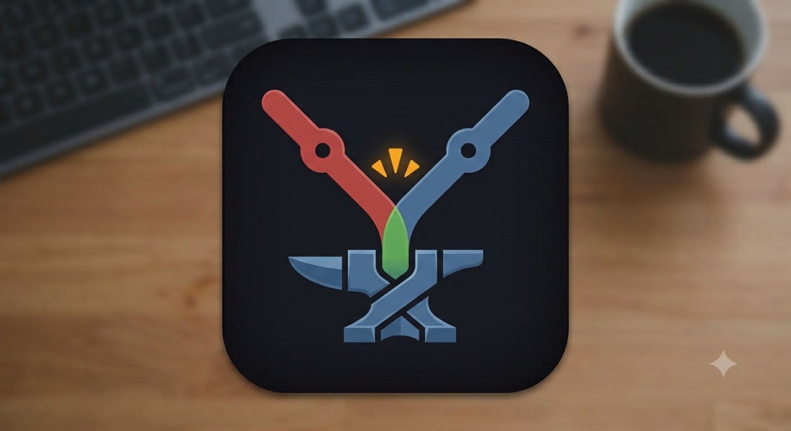
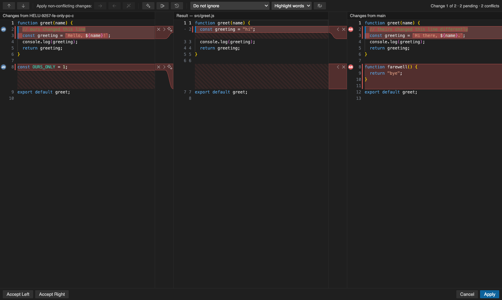
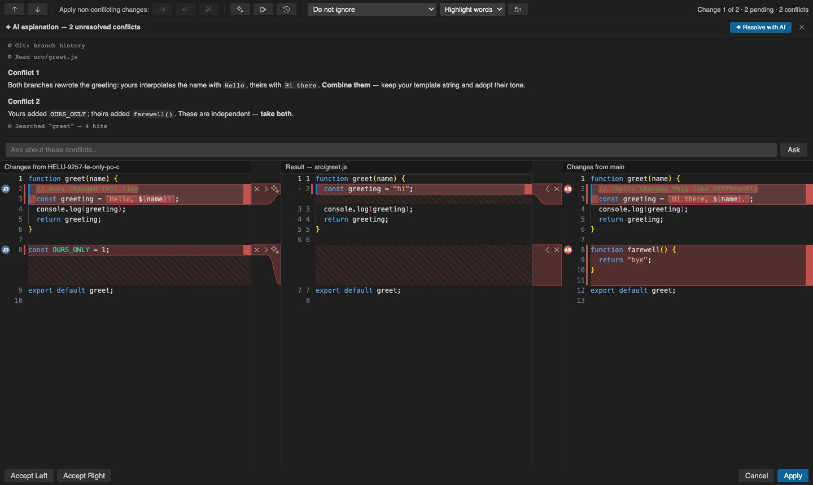
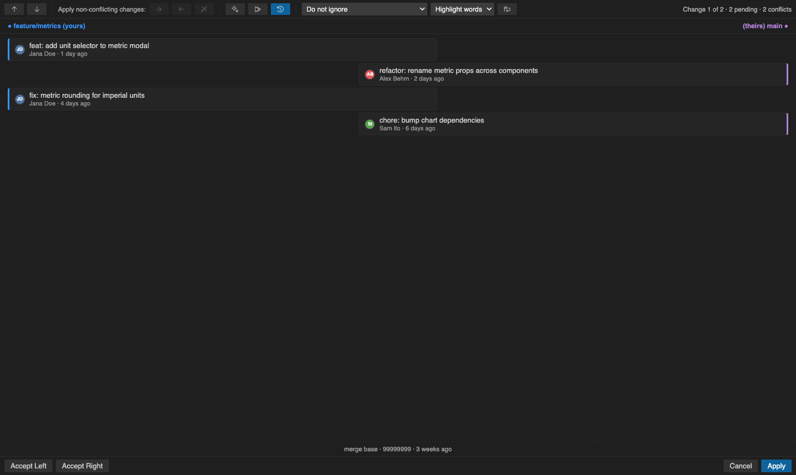

<p align="center">
  
</p>

# MergeForge

A JetBrains/WebStorm-style **three-pane visual merge conflict resolver** for VS Code and Cursor — with an AI assistant that actually reads your repository.



VS Code's built-in merge editor stacks _Incoming_ and _Current_ above the result. MergeForge uses the layout JetBrains users know instead: **your version, the result, and theirs**, side by side and scrolled together. Left is your local version, center is the editable result seeded from the common ancestor, right is the incoming branch.

## The merge editor

- **`»` / `«` to accept, `×` to ignore** — per-chunk controls in the gutter strips, with connector bands linking each change to its place in the result. On a conflict, take one side or both in the order you click them.
- **Apply All Non-Conflicting Changes** (the wand) resolves everything only one side touched, leaving the real decisions to you. Also available per side.
- **Magic Resolve** settles conflicts where both sides simply _added_ lines by keeping both — and deliberately refuses genuine rewrites, where guessing would drop someone's work.
- **Edit the result freely** — hand-write a blend of both sides; an edited chunk counts as decided. Everything is undoable with ordinary Cmd/Ctrl+Z.
- **JetBrains colours** — blue modified, green added, gray deleted, red conflict — plus word-level diff emphasis, base line numbers in the result margin, and your editor's own font in all three panes.
- **Apply** writes the result and runs `git add`; applying with conflicts still open asks first. **Abort** leaves the conflicted file untouched.
- Line endings, BOMs, and missing trailing newlines round-trip; CRLF/LF disagreements surface a choice. Binary and 10 MB+ files are refused with honest guidance instead of garbage panes.

## The AI assistant



Works out of the box in **VS Code with GitHub Copilot** (via the Language Model API), or with your own API key for **Anthropic, OpenAI, DeepSeek, Kimi/Moonshot**, or **any OpenAI-compatible endpoint** (OpenRouter, local Ollama, proxies). Set up once with _Merge Forge: Set AI Provider & API Key_; keys live in VS Code's secret storage and are used only for these requests.

- **✦ Explain conflicts** — a streamed, per-conflict analysis of what each branch changed, why they collide, and a suggested resolution.
- **✦ Resolve with AI** — writes merged code into the result pane as ordinary resolved chunks: review it in the three panes, undo per conflict, nothing touches git until you Apply. Unparseable answers get one automatic retry; whatever fails stays open for you.
- **▶ Fix all** — non-conflicting changes are applied mechanically (deterministic, no tokens spent), only the red conflicts go to the model, one combined report.
- **The model reads your repo, not just the conflict.** Every request carries the surrounding file and each branch's commit intent, and the model can call read-only tools — read files, search code, inspect git history, look up symbols — with live `⚙` activity lines in the drawer so you see exactly what it consulted.
- **Ask follow-ups** in the drawer's chat box, with full conversation context.
- A per-conflict **✦ menu** on every red chunk scopes any of this to a single conflict.

## Who wrote this, and how did we get here?



- **Authorship chips** — each conflict side shows the engineer who last shaped it (GitHub avatars when derivable, colored initials otherwise, fully offline-safe). Click for the commit, date, subject, and links to the commit and profile on GitHub.
- **⟲ History timeline** — one toggle swaps the panes for a chronological two-lane view of the commits that produced this merge, yours vs theirs, merge base marked. Esc returns with all state intact.

## The workflow around the editor

- **Conflicts dialog** — every conflicted file with Yours/Theirs status columns, Accept-side bulk actions, and "2 of 5 resolved" progress. Opens automatically when a merge, rebase, or cherry-pick hits conflicts (configurable).
- **Status bar cluster** — "⚠ Merging main → feature" with one-click access to the dialog and a guarded abort.
- **Next-file loop** — after Apply, jump straight to the next conflicted file via the toast, or set `mergeForge.autoAdvance` and never stop.
- **Crash safety** — half-done merges are snapshotted as you work; reopening the same merge offers "Restore / Discard". Never silent, never stale.
- **Rebase & cherry-pick aware** — git swaps its stages mid-rebase; MergeForge swaps them back so the left pane is always _your_ work — in the panes, the blame chips, and the timeline alike.
- **Delete/modify conflicts** get a clear keep-or-delete choice instead of empty panes.

## Getting started

Open a file with conflicts and use any of:

- the editor title bar button, or the **Resolve in Merge Forge** CodeLens above a conflict
- right-click the file in the Explorer or Source Control view
- **Merge Forge: Resolve Conflicts in File…** from the command palette

## Keyboard

| Keys              | Action                                            |
| ----------------- | ------------------------------------------------- |
| `F7` / `Shift+F7` | Next / previous change                            |
| `Alt+←` / `Alt+→` | Accept the left / right side of the current chunk |
| `Cmd/Ctrl+F`      | Find in any pane                                  |
| `Cmd/Ctrl+Z`      | Undo any resolution, including AI ones            |
| `Esc`             | Close menus, popovers, or the history view        |

## Settings

| Setting                              | Default     | Description                                                           |
| ------------------------------------ | ----------- | --------------------------------------------------------------------- |
| `mergeForge.autoOpenOnConflict`      | `false`     | Open the merge editor automatically when you open a conflicted file.  |
| `mergeForge.autoShowConflicts`       | `true`      | Open the Conflicts dialog when an operation hits conflicts.           |
| `mergeForge.autoApplyNonConflicting` | `false`     | Apply all non-conflicting changes as soon as the editor opens.        |
| `mergeForge.autoAdvance`             | `false`     | After Apply, open the next conflicted file immediately.               |
| `mergeForge.lineEnding`              | `"auto"`    | Result line ending when the sides disagree. `auto` follows your side. |
| `mergeForge.ai.provider`             | `anthropic` | AI backend when the editor offers no models of its own.               |
| `mergeForge.ai.model`                | `"auto"`    | Model override; `auto` uses the active provider's default.            |
| `mergeForge.ai.customBaseUrl`        | —           | Base URL for the Custom provider (e.g. `http://localhost:11434/v1`).  |
| `mergeForge.ai.customModel`          | —           | Model ID for the Custom provider.                                     |

## Notes for Cursor users

Cursor does not expose its built-in models to extensions, so the AI features use your configured provider key — any of the five above; a local Ollama endpoint via the Custom provider works too. Everything else is identical.

## Correctness

The chunking engine is checked against real `git merge-file` output: on generated conflict cases it must agree with git about _what conflicts_, and where git merges cleanly its auto-merge output must match git **byte for byte**. Line endings, BOMs, and missing trailing newlines are covered by tests against real conflicted repositories. The AI pipeline ships with a replay eval (`dev/eval`) that re-runs real historical merges and scores the model against the human resolution.

## Development

```sh
pnpm install
pnpm run watch     # extension host + webview + Monaco worker
# press F5 to launch the Extension Development Host

pnpm test          # unit, git-parity, and end-to-end tests
pnpm run check     # format + lint + typecheck + test
pnpm run package   # build a .vsix

node scripts/make-conflict-repo.mjs            # throwaway repo with every conflict shape
node scripts/make-conflict-repo.mjs --rebase   # ...stopped mid-rebase instead
```

To iterate on the UI without launching an editor, serve the repo and open `dev/harness.html` — it drives the real webview bundle in a plain browser with a stubbed host, including `?scenario=hero|ai|history|light` self-driving states.

## License

MIT
